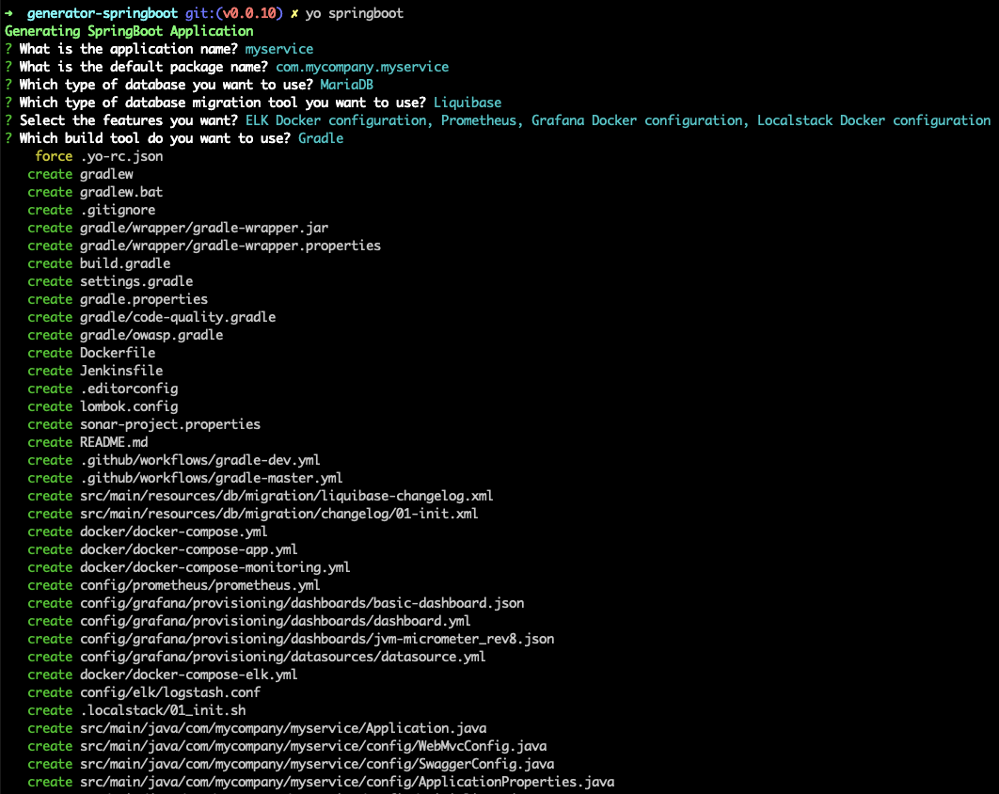
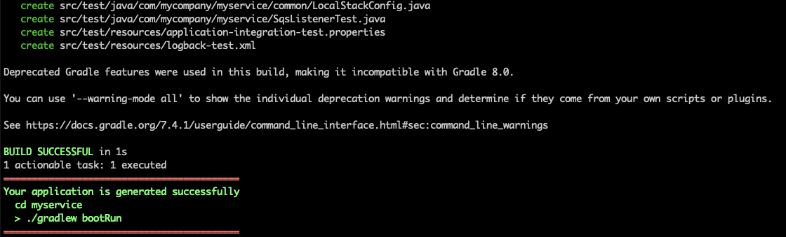
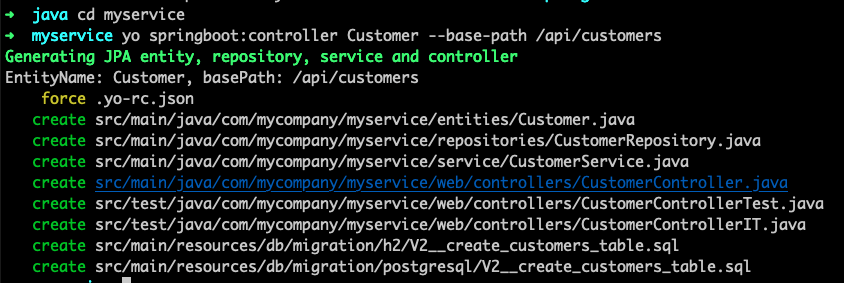

# generator-springboot
A Yeoman generator for generating Microservices with SpringBoot

## How to use?

```
> npm install -g yo
> npm install -g generator-springboot
> yo springboot
```

## Features

* SpringBoot REST API with jar type packaging
* CORS configuration
* Swagger UI Integration
* Spring Data JPA integration with option to select databases like MySQL, Postgresql, MariaDB etc
* Flyway or Liquibase data migration support
* SpringBoot Actuator configuration
* TestContainers integration
* JUnit 5 
* Docker configuration for Application, ELK, Prometheus, Grafana
* Localstack configuration
* Jenkinsfile
* GitHub Actions Configuration
* SonarQube, Google-java-format static analysis tools configuration


### Generate SpringBoot Microservice




### Generate REST API with CRUD operations
You can generate REST API with CRUD operation using the following command:

:high_brightness: You should run the following command from within the generated project folder. 

`myservice> yo springboot:controller Customer --base-path /api/customers`

This will generate:
* JPA entity
* Spring Data JPA Repository
* Service
* Spring MVC REST Controller with CRUD operations
* Unit and Integration Tests for REST Controller
* Flyway or Liquibase migration to create table




## Why another generator when you have JHipster?
JHipster is an amazing SpringBoot application generator with lots and lots of cool features.
However, there are certain JHipster features that does not fit for my preferences such as:

1. I like *jar* packaging
2. I like to use spring-boot-starter-* than configuring individual libraries
3. I like to have an option to generate application without spring-security
4. I prefer Flyway to Liquibase
5. I like to have only minimum and required configuration ie no AsyncConfiguration, LocaleConfiguration, CacheConfiguration, Logstash Logging etc.
6. I like .properties over .yml

## Local Development Setup

```
> git clone https://github.com/sivaprasadreddy/generator-springboot.git
> cd generator-springboot
> npm install 
> npm link
> yo springboot
```

## Changelog

### Version 0.0.5
* Added support for generating docker-compose yml files for application, ELK, Prometheus, Grafana

### Version 0.0.6
* Updated to use testcontainers-spring-boot https://github.com/testcontainers/testcontainers-spring-boot
* Generate Zipkin docker-compose file when Distributed Tracing is selected
* Fixed Flyway/Liquibase db migration script generation issue
* Added tests for sanity check

### Version 0.0.7
* Removed support for generation of `config-server` and `service-registry`
* Updated SpringBoot and other libraries version

### Version 0.0.8
* Configured Checkstyle, PMD, SonarQube, google-java-format plugins
* Added Localstack autoconfiguration support

### Version 0.0.10
* Upgraded SpringBoot to 2.6.7 and library versions
* Updated Spring Cloud AWS setup to use new https://awspring.io/ based configuration
* Removed `springfox-boot-starter` and used `springdoc-openapi-ui`
* Added google-java-format support
* Upgraded plugins versions
* Removed Checkstyle, PMD plugins
